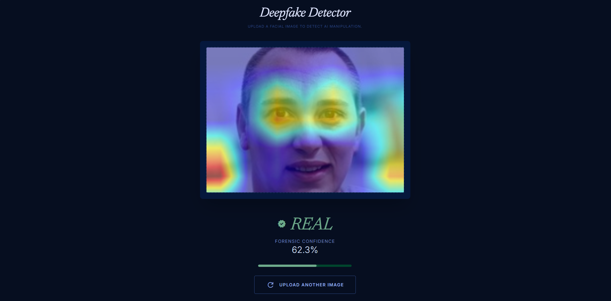
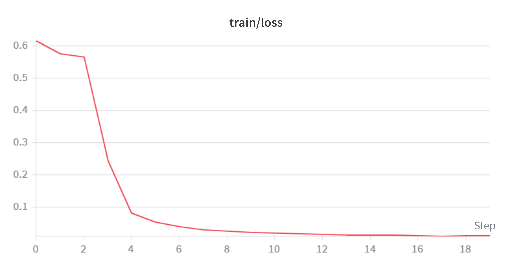
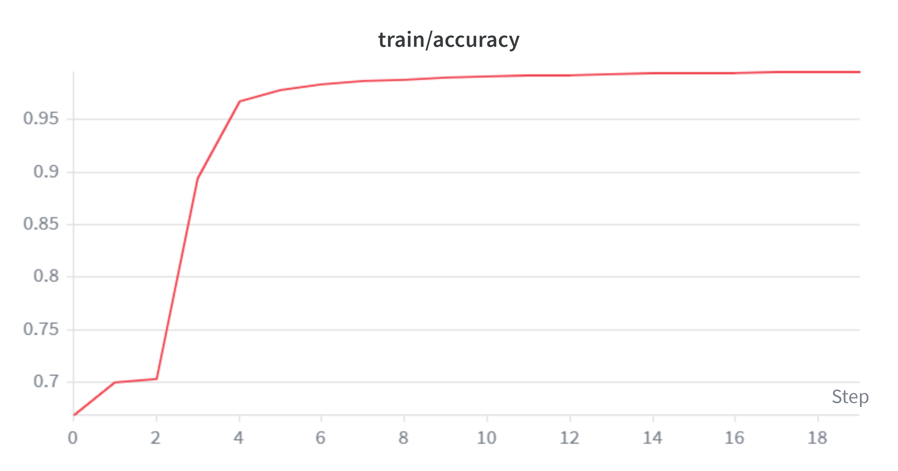
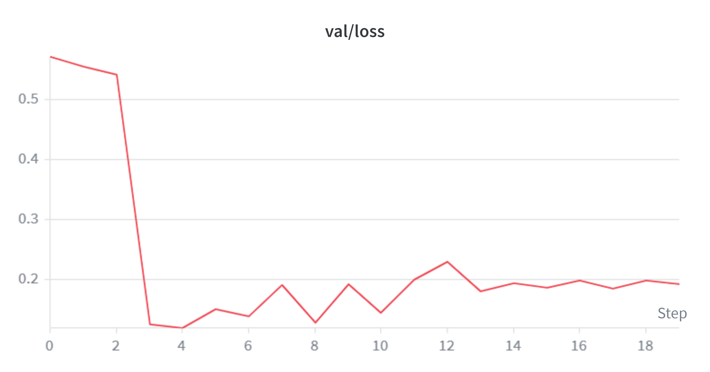
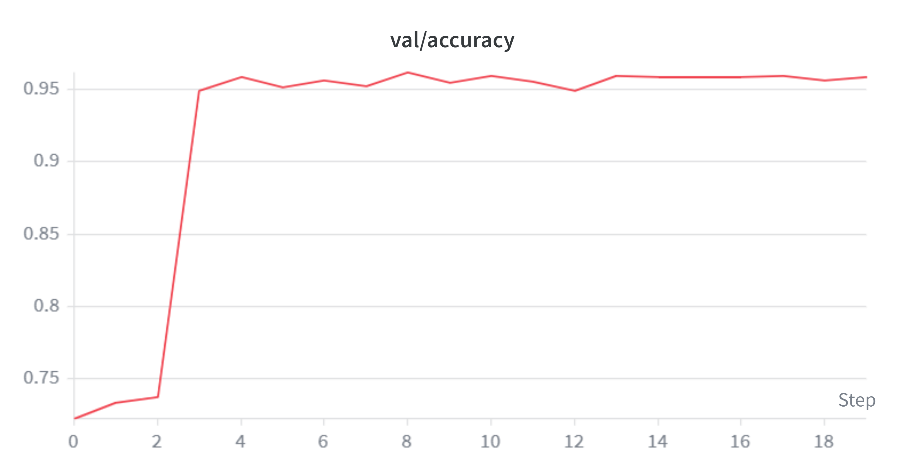

# Deepfake Detector



A web-based forensic tool for detecting AI-manipulated facial images and videos using EfficientNet-B4, trained on FaceForensics++.

Built by **Team Vincenzo** — Computer Vision Course Project, IIIT-Delhi.

---

## Overview

Upload a face image or video and the system will:
- Classify it as **REAL** or **FAKE** with a confidence score
- Generate a **Grad-CAM heatmap** highlighting regions the model focused on
- For videos: sample up to 20 face-containing frames, aggregate predictions, and show how many frames were flagged
- **Adversarial robustness test**: apply FGSM perturbations to any image and see if the model gets fooled
- Reject non-face media (cats, landscapes, etc.)

---

## Results

Trained on FaceForensics++ (C23) — Deepfakes + Original videos.

| Metric | Test Score |
|--------|-----------|
| Accuracy | **96.1%** |
| F1-Score | **96.3%** |
| AUC-ROC | **99.5%** |

### Training Curves

| Train Loss | Train Accuracy |
|:---:|:---:|
|  |  |

| Val Loss | Val Accuracy |
|:---:|:---:|
|  |  |

---

## Tech Stack

| Component | Technology |
|-----------|-----------|
| Frontend | Next.js 15, Tailwind CSS |
| Backend | FastAPI (Python) |
| Model | EfficientNet-B4 (via timm) |
| Localization | Grad-CAM |
| Face Detection | MTCNN (preprocessing), OpenCV Haar Cascade (inference) |
| Video Analysis | OpenCV frame sampling + per-frame inference aggregation |
| Experiment Tracking | Weights & Biases |
| Training Infra | IIITD Precision Cluster — A100 40GB (SLURM) |

---

## Project Structure

```
deepfake-detector/
├── app/
│   ├── globals.css              # Tailwind + Material Symbols
│   ├── layout.tsx               # Root layout (Inter + Newsreader fonts)
│   └── page.tsx                 # Main page (upload, results, states)
├── components/
│   ├── ImageUpload.tsx          # Drag & drop upload (image + video)
│   └── ResultDisplay.tsx        # Verdict + confidence meter + frame stats
├── backend/
│   ├── checkpoints/
│   │   └── best_model.pth       # Trained weights (202MB, not in git)
│   ├── main.py                  # FastAPI server (/predict, /predict_video, /adversarial)
│   ├── model.py                 # EfficientNet-B4 inference + Grad-CAM + video + FGSM
│   ├── dataset.py               # PyTorch dataset + video-level splits
│   ├── preprocess.py            # Video → face crop pipeline (MTCNN)
│   ├── train.py                 # Training loop + W&B logging
│   ├── evaluate_generalization.py  # Cross-manipulation generalization eval
│   ├── preprocess.sh            # SLURM job script (preprocessing)
│   ├── run.sh                   # SLURM job script (training)
│   ├── eval_gen.sh              # SLURM job script (generalization evaluation)
│   └── requirements.txt
├── public/
│   └── image.png                # UI screenshot
├── next.config.ts               # Proxies /api/* → FastAPI
├── tailwind.config.ts           # Forensic Editorial design tokens
└── FINDINGS.md                  # Full documentation & results
```

---

## Getting Started

### Prerequisites
- Node.js 18+
- Python 3.10+

### Frontend

```bash
cd deepfake-detector
npm install
npm run dev
```

Runs on `http://localhost:3000`

### Backend

```bash
cd deepfake-detector/backend
python -m venv deepfake-backend
deepfake-backend\Scripts\activate       # Windows
pip install -r requirements.txt
uvicorn main:app --reload
```

Runs on `http://localhost:8000`

The Next.js app proxies `/api/*` → `http://localhost:8000/*` automatically.

> **Note:** You need the trained model weights at `backend/checkpoints/best_model.pth`. These are not included in the repo due to size (202MB).

---

## Training Pipeline

To retrain the model from scratch:

1. **Download dataset:** FaceForensics++ C23 from [Kaggle](https://www.kaggle.com/datasets/xdxd003/ff-c23)
2. **Preprocess:** `python preprocess.py` — extracts face crops from videos using MTCNN
3. **Train:** `python train.py` — EfficientNet-B4, 20 epochs, freeze→unfreeze strategy

See [`FINDINGS.md`](./FINDINGS.md) for full details on hyperparameters, augmentations, and infrastructure setup.

---

## Team Vincenzo

| Name | ID |
|------|----|
| Balaiah Tarun | 2022132 |
| Md Kaif | 2022289 |
| Nishant Kumar Singh | 2022327 |
| Vaishvi Verma | 2022609 |
